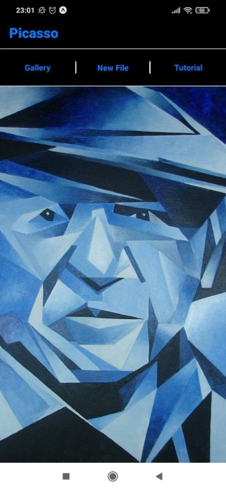
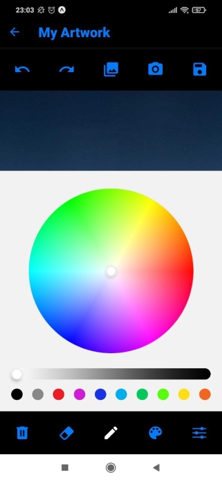
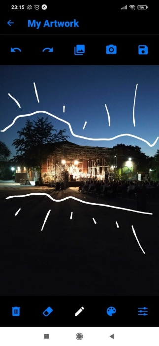
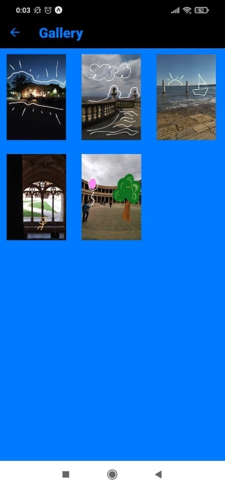

# Picasso ✏️

## About the Project 📚

A drawing app built in React Native that allows the user to sketch over a blank canvas or a background image (either chosen from the user's media library or taken with the camera) and save it. It is possible to change colour and thickness of the brush stroke, as well as erase some parts of the drawing or clear the whole canvas.  

## Screenshots 📷

   

## Technologies Used ⚛️ 

- Expo SDK 45 (React Native v0.68)
- [react-native-signature-canvas](https://github.com/YanYuanFE/react-native-signature-canvas)
- [expo-camera](https://docs.expo.dev/versions/latest/sdk/camera/)
- [expo-image-picker](https://docs.expo.dev/versions/v45.0.0/sdk/imagepicker/)
- [@react-native-async-storage/async-storage](https://docs.expo.dev/versions/v45.0.0/sdk/async-storage/)
- [@react-navigation](https://reactnavigation.org/)
- [react-native-gesture-handler](https://docs.expo.dev/versions/latest/sdk/gesture-handler/)
- [react-native-reanimated](https://docs.expo.dev/versions/latest/sdk/reanimated/)
- [react-native-screens](https://docs.expo.dev/versions/v45.0.0/sdk/screens/)
- [react-native-safe-area-context](https://docs.expo.dev/versions/v45.0.0/sdk/safe-area-context/)
- [@react-native-community/masked-view](https://docs.expo.dev/versions/v45.0.0/sdk/masked-view/)
- [react-native-pager-view](https://docs.expo.dev/versions/v45.0.0/sdk/view-pager/)

## Contributors 👫

* [Andrea1302](https://github.com/Andrea1302)
* [lidiaCirrone](https://github.com/lidiaCirrone)
